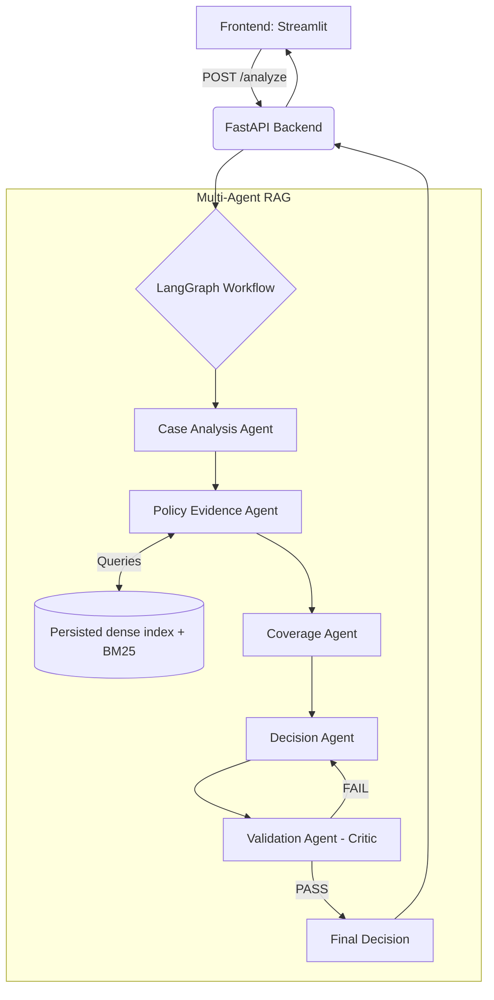

# Aptino AI - Health Insurance Claims Decision Engine

This repository contains the implementation of a Multi-Agent RAG system for evaluating health insurance claims against the Universal Sompo General Insurance Company policy (2017-2018).

## Architecture Diagram



## Setup Instructions

### Prerequisites
- Python 3.10+
- Groq API Key

### Installation

1. Clone the repository and navigate to the project root.
2. Create a virtual environment and install dependencies:
   ```bash
   python -m venv venv
   source venv/bin/activate  # On Windows: .\venv\Scripts\activate
   pip install -r requirements.txt
   ```
3. Set your environment variables:
   ```bash
   export GROQ_API_KEY="your_api_key_here"
   export API_URL="http://localhost:8000"
   ```

### Pre-building the Vector Index (for Render Deployment)
Since Render's free tier has an ephemeral filesystem, we build the dense and BM25 indexes offline and commit them to the repository.
```bash
python -m ingestion.indexer "Given Data/policy/USGIC-CSCIndividualHealthInsurance_2017-2018.pdf"
```
Ensure the `chroma_db` folder is committed to Git if deploying to an ephemeral environment. It contains portable pickle files for the dense embedding matrix and BM25 metadata; it does not require a vector-database service.

### Running the Services

**Backend API:**
```bash
uvicorn api.main:app --reload --port 8000
```
API Documentation is available at `http://localhost:8000/docs`.

**Frontend UI:**
In a new terminal window:
```bash
streamlit run frontend/app.py
```

## Design Decisions
- **Hybrid Retrieval**: We use a fusion of dense embeddings (`sentence-transformers/all-MiniLM-L6-v2`) and sparse retrieval (BM25) with Reciprocal Rank Fusion (RRF). This ensures high recall for both semantic concepts ("pre-existing disease") and exact keywords (specific medical procedures).
- **LangGraph State Machine**: A multi-agent graph routes the processing logically: extraction -> retrieval -> coverage reasoning -> decision -> validation. This modularity allows us to insert a LLM-as-judge critic (`Validation Agent`).
- **Validation Guardrail**: The Validation Agent acts as a strict critic. If the Decision Agent makes claims unsupported by the citations, the validation fails and loops back. We limit this loop to a maximum of 2 iterations to prevent infinite loops, defaulting to `NEEDS_REVIEW` if it fails completely.

## Evaluation & Test Case Results

The decision engine was evaluated using end-to-end evaluation scripts across all 12 public cases and 5 candidate-created custom cases.

### Running Evaluation
```bash
python run_evaluation.py           # Evaluates 12 public cases
python evaluation/evaluate_pipeline.py  # Evaluates all 17 cases (12 public + 5 custom)
```

### Public Test Cases Results (12 Cases)

| Case ID | Scenario Description | Expected Outcome | Key Reason / Policy Provision | Citation |
| :--- | :--- | :--- | :--- | :--- |
| **`PUB-001`** | Acute appendicitis inpatient surgery | `ADMISSIBLE_WITH_LIMITS` | Room rent ₹30k exceeds 1% BSI/day cap (₹5k/day); ambulance ₹1.2k exceeds ₹1,000 cap. | Page 7 (`chunk_6_0`), Page 10 (`chunk_10_0`) |
| **`PUB-002`** | Viral fever claim on Day 19 of cover | `NOT_ADMISSIBLE` | Incurred inside 30-day initial waiting period from policy inception (19 days < 30 days). | Page 9 (`chunk_9_0`) |
| **`PUB-003`** | Pre-existing condition (27m coverage) | `NOT_ADMISSIBLE` | Excluded until 48 months of continuous coverage elapse (27m < 48m required). | Page 9 (`chunk_9_0`) |
| **`PUB-004`** | Domiciliary treatment | `ADMISSIBLE_WITH_LIMITS` | Domiciliary treatment is covered subject to 20%/40% Sum Insured category cap. | Page 8 (`chunk_8_0`) |
| **`PUB-005`** | Cataract day-care surgery (29m coverage) | `ADMISSIBLE_WITH_LIMITS` | Cataract day-care surgery covered after 1 year waiting period; sub-limits apply. | Page 9 (`chunk_13_0`) |
| **`PUB-006`** | Acute infection (missing bill & unconfirmed hospital) | `NEEDS_REVIEW` | Safely abstains: `itemized_bill` missing and hospital registration status unconfirmed. | Page 2 (`chunk_0_6`) |
| **`PUB-007`** | Cancer inpatient treatment (SI 10L) | `ADMISSIBLE_WITH_LIMITS` | Covered inpatient treatment; room rent and medicine sub-limits apply to cap payable amount. | Page 7 (`chunk_6_0`), Page 8 (`chunk_8_0`) |
| **`PUB-008`** | Cosmetic surgery procedure | `NOT_ADMISSIBLE` | Cosmetic and aesthetic procedures are explicitly excluded under Policy Section 4. | Page 9 (`chunk_9_0`) |
| **`PUB-009`** | Appendicitis (pre/post-hospitalization) | `ADMISSIBLE_WITH_LIMITS` | Pre-hospitalization (30d) and post-hospitalization (60d) expenses covered within windows. | Page 8 (`chunk_8_0`) |
| **`PUB-010`** | Cataract day-care with portability credit | `ADMISSIBLE_WITH_LIMITS` | 1-year Cataract waiting period waived under portability clause due to 1-year continuous prior coverage. | Page 9 (`chunk_13_0`) |
| **`PUB-011`** | Appendectomy with unconfirmed hospital criteria | `NEEDS_REVIEW` | Safely abstains: hospital minimum criteria not documented in evidence context. | Page 2 (`chunk_0_6`) |
| **`PUB-012`** | Experimental therapy for experimental condition | `NOT_ADMISSIBLE` | Unproven and experimental treatments are explicitly excluded under Policy Section 4. | Page 5 (`chunk_0_20`) |

### Candidate-Created Custom Test Cases (5 Cases)

| Case ID | Scenario Description | Expected Outcome | Verification Purpose |
| :--- | :--- | :--- | :--- |
| **`CUST-001`** | Renal failure dialysis (1-year wait check) | `NOT_ADMISSIBLE` | Verifies 1-year listed disease waiting period rule for dialysis. |
| **`CUST-002`** | Domiciliary home care (₹150k claim on ₹500k SI) | `ADMISSIBLE_WITH_LIMITS` | Verifies 20% Sum Insured sub-limit cap (₹100k cap on ₹150k claim). |
| **`CUST-003`** | Cancer diagnosis missing histopathology report | `NEEDS_REVIEW` | Verifies mandatory clinical documentation abstention contract. |
| **`CUST-004`** | Inpatient viral fever with unconfirmed minimum criteria | `NEEDS_REVIEW` | Verifies facility minimum criteria documentation abstention. |
| **`CUST-005`** | Inpatient viral fever with irrelevant input attributes | `ADMISSIBLE` | Verifies system ignores irrelevant attributes (hair color, cafeteria rating). |

### Failure Analysis & Improvements

1. **Failure Scenario 1 — False Positive Abstention on Established Claim Facts**:
   - *Root Cause*: Case Analysis Agent treated provided claim attributes (`continuous_coverage_months`, `policy_start_date`, `prior_policy`) as missing facts requiring external proof.
   - *System Improvement*: Refactored `CaseAnalysisAgent` to accept supplied claim facts as established facts, restricting `NEEDS_REVIEW` flags strictly to missing required clinical/billing documents or unconfirmed mandatory hospital criteria.

2. **Failure Scenario 2 — Status Misclassification (`PARTIALLY_ADMISSIBLE` vs `ADMISSIBLE_WITH_LIMITS`)**:
   - *Root Cause*: Decision Agent classified sub-limit caps (room rent and ambulance deductions) as `PARTIALLY_ADMISSIBLE`.
   - *System Improvement*: Aligned Decision Agent prompt definitions strictly with Section 6 of the assignment specification: sub-limits on covered claims must be labeled `ADMISSIBLE_WITH_LIMITS`.

3. **Failure Scenario 3 — Citation Dropping & Formatting Fallback**:
   - *Root Cause*: Strict dictionary key lookup dropped valid citations when key formatting differed slightly, forcing valid decisions to default to `NEEDS_REVIEW`.
   - *System Improvement*: Implemented robust citation normalization with fallback to ensure valid policy citations are maintained.

## Trade-offs
- **Same-Model Grading Limitation**: We use Groq for both generation (Decision Agent) and evaluation (Validation Agent). While fast, using the same provider family risks confirmation bias. In production, a diverse judge (e.g. Claude 3.5 or GPT-4o) is recommended.
- **Offline Indexing vs Runtime Indexing**: To accommodate ephemeral container filesystems, the index is pre-built offline and persisted.

## Known Limitations
- **Cold Starts**: On free-tier platforms like Render, initial cold-start wakeups may take 30-50 seconds.
- **PDF Extraction**: Document parser uses regex header and page splitting. Complex vision-heavy PDFs might require multimodal parsers.
